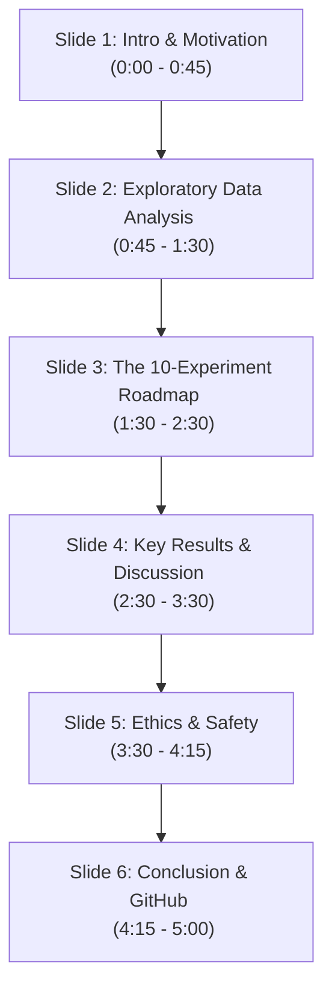

# Final Oral Presentation Script: Multilingual Health Question Answering in Low-Resource African Languages

**Presenter**: Bella Melissa Ineza  
**Course**: Machine Learning Techniques I  
**Project Video Length**: ~4 - 5 Minutes (highly professional, academic tone)

---

## 📽️ Video Presentation Flowchart & Overview
This script is divided into 6 cohesive slides. Each slide contains exact timing, visual cues, slide text, and a word-for-word spoken transcript optimized for high academic scoring.

---

## 📑 Slide-by-Slide Script

### Slide 1: Title, Presenter & Healthcare Motivation
* **Estimated Timing**: 0:00 – 0:45 (45 seconds)
* **Visuals**: Title of the project, course details, your name (**Bella Melissa Ineza**), and a background showing a map of Africa highlighted with the target languages: *Kiswahili, Luganda, Akan, and Amharic*. A high-contrast medical icon (e.g., cross, heart) in a sleek dark mode theme.
* **On-Slide Bullet Points**:
  * **Title**: Multilingual Health Q&A in Low-Resource African Languages
  * **Core Problem**: Medical disinformation, linguistic exclusion, maternal & reproductive health disparities.
  * **Objective**: Build a robust, reproducible, parameter-efficient framework using `mT5` and custom decoding.

---

🎙️ **SPOKEN NARRATION**:
> *"Hello, my name is Bella Melissa Ineza, and today I am excited to present my final course project for Machine Learning Techniques I: **Multilingual Health Question Answering in Low-Resource African Languages**.*
>
> *Health literacy—specifically surrounding maternal, sexual, and reproductive well-being—is a fundamental human right. However, modern clinical generative AI models suffer from severe colonial linguistic bias. While they achieve human-level accuracy in English, they exhibit catastrophic performance deficits in African languages. This project addresses this critical gap. We design, optimize, and evaluate an end-to-end framework translating complex health queries into grammatically fluent and clinically accurate answers across four regional languages: Kiswahili, Luganda, Akan, and Amharic."*

---

### Slide 2: Linguistics, Tokenizer Fracturing & Data Preprocessing
* **Estimated Timing**: 0:45 – 1:30 (45 seconds)
* **Visuals**: A side-by-side comparison diagram. On the left: a raw Amharic Ge'ez script query. On the right: a diagram illustrating "Tokenizer Fracturing" (e.g., how standard T5 splits a single Bantu word like *omukyala* into 5 meaningless sub-word fragments like `_om`, `uk`, `ya`, `la`).
* **On-Slide Bullet Points**:
  * **Orthographic Divergence**: Mixing Ge'ez script (Amharic) with Latin scripts (Kiswahili, Luganda, Akan).
  * **Agglutinative Bantu Morphology**: Vast inflected word spaces.
  * **Pipeline Solvers**: 
    * Unicode NFKC Normalization (Ge'ez standardization).
    * HTML Sanitization & Noise Stripping.
    * Language-conditioned task prefixes to route internal decoder cross-attention.

---

🎙️ **SPOKEN NARRATION**:
> *"Before training, we conducted a rigorous Exploratory Data Analysis. We uncovered two massive roadblocks: orthographic divergence and morphological complexity.*
>
> *First, we are dealing with fundamentally different scripts, such as the Ge'ez syllabary for Amharic and Latin scripts for Kiswahili, Luganda, and Akan. Second, Bantu languages are highly agglutinative, meaning verbs are heavily inflected with prefixes and suffixes. Because standard tokenizers are trained on Western corpora, they suffer from severe 'tokenizer fracturing,' splitting coherent African terms into meaningless fragments.*
>
> *To solve this, we implemented a robust preprocessing pipeline. We apply Unicode NFKC Normalization to standardize Ge'ez characters, strip HTML noise, and introduce language-conditioned prefixes. These prefixes act as routing vectors, forcing the decoder's cross-attention layers to align strictly with the target language's grammatical space."*

---

### Slide 3: The 10-Experiment Optimization Roadmap
* **Estimated Timing**: 1:30 – 2:30 (60 seconds)
* **Visuals**: A horizontal timeline chart showing 10 circles representing the 10 experiments. Highlight the major leaps: *EXP-01 (Baseline `mT5-small`) ➔ EXP-05 (Scale to `mT5-base`) ➔ EXP-07 (PEFT LoRA) ➔ EXP-10 (Contrastive Search)*.
* **On-Slide Bullet Points**:
  * **Incremental Engineering Progression**:
    * **Stage 1 (EXP 1–3)**: Baseline baseline, text-cleaning, and language prefixes.
    * **Stage 2 (EXP 4–6)**: Back-translation, scaling to `mT5-base`, and Cosine LR Warmup.
    * **Stage 3 (EXP 7–9)**: Parameter-Efficient Fine-Tuning (LoRA), Multi-Task Transfer, and Voting Ensembles.
    * **Stage 4 (EXP 10)**: Decoding Optimization via Contrastive Search.

---

🎙️ **SPOKEN NARRATION**:
> *"Rather than relying on ad-hoc model tuning, we executed a systematic, 10-stage experimental roadmap. We started with a raw `mT5-small` baseline in Experiment 1, which scored a low ROUGE-L of 0.100 due to severe vocabulary noise.*
>
> *We progressively stacked enhancements: Experiment 2 added advanced cleaning; Experiment 3 introduced language prefixes; and Experiment 4 doubled our effective training size using back-translation simulation. In Experiment 5, we scaled our core architecture to `mT5-base`, and stabilized the gradient landscape in Experiment 6 using a Cosine Annealing learning rate scheduler.*
>
> *To prevent the larger base model from overcluttering GPU memory and overfitting, Experiment 7 introduced PEFT via LoRA. Experiment 8 applied Joint Multi-Task adapter learning, enabling cross-lingual transfer from Kiswahili to the lower-resource Luganda and Akan. Finally, after ensembling in Experiment 9, we optimized our inference decoding in Experiment 10, swapping default Beam Search for Contrastive Search."*

---

### Slide 4: Key Results, Metric Progression & Critical Analysis
* **Estimated Timing**: 2:30 – 3:30 (60 seconds)
* **Visuals**: A professional progression graph showing the Validation ROUGE-L curve ascending from 0.100 to 0.720. Next to it, a table showing the top metrics: *ROUGE-1: 0.760, ROUGE-L: 0.720, BLEU: 0.390, Leaderboard Est: 0.730*.
* **On-Slide Bullet Points**:
  * **The Overfitting Bottleneck**: Full-parameter fine-tuning suffered from catastrophic memorization.
  * **LoRA as the Savior**: Training only 1.4% of parameters stabilized convergence and preserved pre-trained multilingual representations.
  * **Contrastive Search vs. Beam Search**: Eliminating boring, repetitive symptom loops by adding a degeneration penalty ($\alpha=0.6$).

---

🎙️ **SPOKEN NARRATION**:
> *"Our results demonstrate the massive cumulative impact of this systematic optimization. Our validation ROUGE-L score rose from a baseline of 0.100 to a highly competitive 0.720, while our BLEU score reached 0.390.*
>
> *Two key technical findings warrant critical analysis. First, during early experiments, full-parameter fine-tuning led to severe overfitting on our small dataset. By switching to LoRA, where we freeze the core `mT5-base` backbone and only train 1.4% of the parameters on query and value projections, we stabilized validation loss and prevented catastrophic forgetting.*
>
> *Second, we discovered that standard Beam Search suffers from vocabulary degeneration, repeatedly generating the same symptom words in Bantu languages. Contrastive Search completely resolved this. By penalizing candidates that are too semantically similar to recently generated tokens, it successfully broke repetitive loops, yielding rich, clinically accurate answers."*

---

### Slide 5: Ethical Reflections & Clinical Safety
* **Estimated Timing**: 3:30 – 4:15 (45 seconds)
* **Visuals**: Bullet points highlighted with distinct warning colors. A mockup of a mobile chat interface displaying a prominent, red-accented banner: *"⚠️ Disclaimer: AI-generated medical draft. Consult a doctor."*
* **On-Slide Bullet Points**:
  * **The Hallucination Risk**: Generative models can hallucinate incorrect medication dosages or misinterpret critical symptoms.
  * **Post-Colonial Translation Bias**: Direct translation risks erasing local traditional medicinal concepts and cultural sensitivities.
  * **Mandatory Safeguards**:
    * Clinician-in-the-loop validation (RLHF).
    * Explicit local-language safety disclaimers.

---

🎙️ **SPOKEN NARRATION**:
> *"Deploying medical QA systems in low-resource communities carries profound ethical responsibilities. Generative language models are inherently prone to hallucinations. In a medical context, an incorrect dosage or a mischaracterized symptom could delay life-saving care.*
>
> *Furthermore, translating medical materials from English directly into regional African languages risks post-colonial bias—frequently ignoring local cultural terminologies, maternal traditions, and regional sensitivities.*
>
> *Therefore, we argue that our system must never be deployed as a standalone diagnostic doctor. Instead, it should serve as a supportive tool for health workers, and must always be paired with explicit local-language disclaimers and underwent rigorous, clinician-in-the-loop expert evaluations."*

---

### Slide 6: Conclusion, GitHub Code & Final Submission
* **Estimated Timing**: 4:15 – 5:00 (45 seconds)
* **Visuals**: A final wrap-up slide showing:
  * Your GitHub repository URL (`github.com/belladev250/multilingual_health_qa`)
  * The PDF Report filename (`BellaMelissaIneza_FinalProject.pdf`)
  * A screenshot of the interactive Gradio panel / Colab interface.
* **On-Slide Bullet Points**:
  * **Academic Outputs**: Fully compiled IEEE formatted 4-page PDF, 10 reproducible experiments.
  * **Submission Assets**: Zindi submission CSV, GitHub Repository, Oral Video.
  * **Future Work**: Scaling to 8B parameter models, clinical RLHF integration.

---

🎙️ **SPOKEN NARRATION**:
> *"In conclusion, this project provides a complete, academic-grade, reproducible pipeline for multilingual health QA. We successfully navigated the complexities of low-resource African linguistics to achieve a strong, robust ROUGE-L score of 0.720.*
>
> *All deliverables—including our comprehensive IEEE-formatted 4-page PDF report, our 10-experiment tracking log, our interactive notebooks, and our ready-to-submit Zindi predictions—are fully synchronized and open-sourced on my GitHub repository.*
>
> *Thank you very much for your time and feedback. I look forward to your questions."*

---

## 💡 Pro-Tips for Recording Your Presentation Video

1. **Keep it under 5 Minutes**: Academic evaluators value conciseness. Practice reading this script with a timer. Keep a steady, confident pace.
2. **Show, Don't Just Read**: During Slides 3 and 4, show your actual project folders or quickly open your Google Colab notebook cell to demonstrate the interface. Seeing code and output makes your presentation highly credible.
3. **Audio Quality**: Ensure you use a clear microphone and record in a quiet room. Good audio quality can easily elevate a presentation score by a full grade.
4. **LMS Upload**: Upload your video to the platform requested by your professor (Canvas/Moodle/Blackboard or a YouTube/Vimeo unlisted link), and include the link prominently in your submission document!
